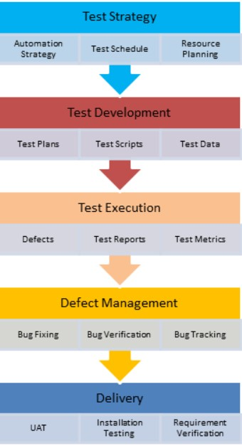

# Test Strategy
Test strategy document in software testing (sample template)

## What is a Test Strategy
### A test strategy 
is a set of basic principles that define test development and regulate how the software testing process will be carried out. The goal of a test strategy is to provide a systematic approach to the testing process to ensure quality, traceability, reliability, and better planning.

## What is a test strategy document?
### A test strategy document 
is a well-described software testing document that clearly defines the exact software testing approach and goals for testing an application. A test document is an important document for quality assurance teams, created based on actual business requirements, that guides the entire team on the software testing approach and objectives for each activity in the software testing process.

The test strategy document answers all the questions, such as what you want to do, how you are going to achieve it, etc. Writing an effective strategy document is a skill that a tester develops with experience. The test strategy plan should be communicated to the entire team so that the team is aligned on the approach and responsibilities.

## How to prepare a good test strategy document
Every organisation has its own unique priority and set of rules for software development, so don't copy any organisation blindly. Always make sure that their document is compatible and adds value to your software development before proceeding to wing the template.

## Testing strategy at STLC
 

### Step 1) Scope of implementation
It defines such parameters as:

Who will review the document?
Who will approve the document?
Software testing activities performed with timelines

### Step 2) Test approach
This defines: 

The testing process
The levels of testing
Roles and responsibilities of each team member
Types of testing (load testing, security testing, performance testing, etc.)
Testing approach and automation tool, if applicable
Adding new defects, retesting, Defect triage, Regression testing and test signature

### Step 3) Test environment
Determine the number of requirements and parameters needed for each environment
Define test data backup and recovery strategy

### Step 4) Test tools
Automation and test management tools are required to execute the test
Determine the number of open source tools required as well as commercial tools, determine how many users are supported by it, and plan accordingly

### Step 5) Let go of control
A release management plan with an appropriate version history that will ensure that all changes in that release are tested

### Step 6) Analyse the risks
List all the risks you can assess
Provide a clear risk mitigation plan as well as a contingency plan

### Step 7) Review and approval
All these steps are reviewed and signed off by the business team, project management, development team, etc.
A summary of the reviewed changes should be provided at the beginning of the document, along with the approved date, title and comment

## Components of the test strategy document

### 1) Scope and overview:
Defines the approval, review and use of the document.
Identifies the activities and phases of testing that require approval.

### 2) Test methodology:
Details test levels, procedures, team roles and responsibilities.
Includes a change management process for modifying requests.

### 3) Test Environment Specifications:
Defines test data requirements and preparation guidelines.
Outlines the number of environments and their configuration requirements.
Includes backup and recovery strategies to prevent data loss.

### 4) Testing tools:
Details test management and test execution automation tools.
Identifies tools for security, performance, and load testing, including tool types and user capabilities.

### 5) Release Control:
Ensures effective test execution and release management strategies.

### 6) Risk Analysis:
Describes potential project risks that affect test execution.
Includes risk mitigation strategies and a contingency plan.

### 7) Review and Approval:
Includes review by system administration, project management, development, and the business group.
Emphasises the importance of documenting reviews and updates as the test process improves.

